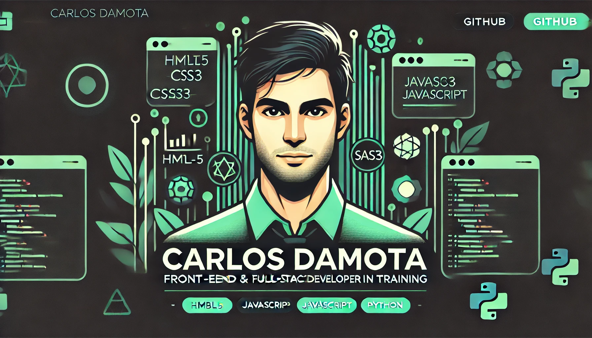

<!-- Imagen de Cabecera -->

  

# ¡Hola, soy Carlos Damota!

  
  
  
  

## Sobre Mí

Desarrollador web full‑stack junior con una sólida trayectoria previa en el sector retail, donde aprendí a trabajar con compromiso, constancia y foco en las personas.

Tras más de 14 años en ese entorno, decidí reinventarme profesionalmente. Acabo de finalizar el Máster en Desarrollo Web Full‑Stack en Nuclio Digital School, donde he trabajado con tecnologías como React, Node.js, MongoDB, Tailwind, Express y Docker, desarrollando proyectos colaborativos con enfoque profesional.

Me gusta escribir código limpio, resolver problemas de forma práctica y seguir aprendiendo cada semana. Valoro el trabajo en equipo, el feedback honesto y las soluciones bien pensadas.

Actualmente, estoy buscando mi primera oportunidad profesional en el sector tech, con ganas de seguir creciendo, aportar desde mi experiencia anterior y desarrollar productos que realmente ayuden a las personas.

Puedes seguir mi evolución y contactarme a través de:
<!-- GitHub Badges -->

## 📊 GitHub Stats

  
    

## 🧰 Tech Stack

  

`html | css | sass | js | ts | react | nextjs | nodejs | express | mongodb | socketio | tailwind | daisyui | docker | git | github | vscode | vercel | netlify | render | postman | python | warp`

---

  

